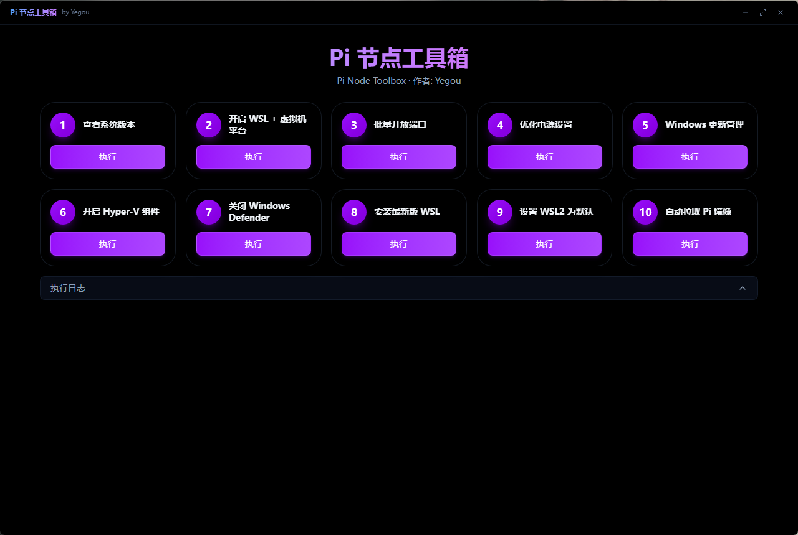

# Pi 节点工具箱

Pi 节点 Windows 环境维护控制台。



## 功能列表

| # | 功能 | 说明 |
|---|------|------|
| 1 | 查看系统版本 | 显示 Windows 版本、内部版本号、系统架构等信息 |
| 2 | 开启 WSL + 虚拟机平台 | 启用 WSL 和虚拟机平台组件（需重启生效） |
| 3 | 批量开放端口 | 放行防火墙端口 31400-31409（TCP+UDP） |
| 4 | 优化电源设置 | 关闭休眠、防止磁盘休眠、5分钟熄屏 |
| 5 | Windows 更新管理 | 禁用或还原 Windows 更新服务 |
| 6 | 开启 Hyper-V 组件 | 启用 Hyper-V 虚拟化平台（需重启生效） |
| 7 | 关闭 Windows Defender | 通过注册表禁用 Defender 实时监控 |
| 8 | 安装最新版 WSL | 自动检测并安装最新 WSL 离线包 |
| 9 | 设置 WSL2 为默认 | 将 WSL 默认版本设为 WSL2 |
| 10 | 自动拉取 Pi 镜像 | 配置 Docker 镜像源并拉取 Pi 节点镜像 |

## 使用说明

- 以管理员身份运行以获得完整功能
- 部分操作需重启系统生效
- 每个功能在执行前会弹出确认框

## 开发

```bash
npm install
npm run electron:dev    # 开发模式
npm run electron:build  # 生产构建
```

作者: Yegou
